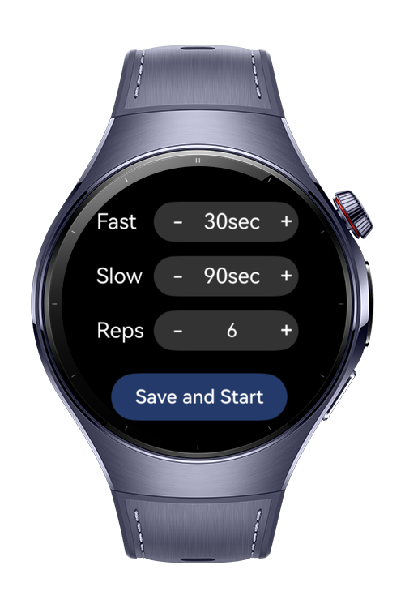
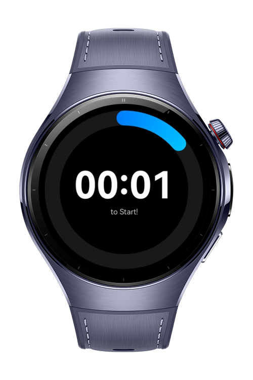
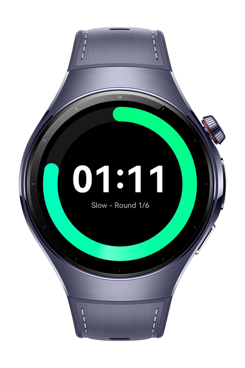

> **Note:** To access all shared projects, get information about environment setup, and view other guides, please visit [Explore-In-HMOS-Wearable Index](https://github.com/Explore-In-HMOS-Wearable/hmos-index).

# Interval Clock
This project demonstrates a sample application for Huawei Wearable Devices that runs with HarmonyOS Next.
It is an interval clock sample app for sports & outdoor users.

## Preview

<div>
   
   
   
</div>

## Use Cases
1. Customizable Intervals: Users can easily set work and rest durations, along with the number of rounds, to match workouts, study sessions, or breathing exercises.
2. Hands-Free Workout Guidance: The app guides users through each phase without needing constant screen interaction.
3. Minimal Watch Interface: Designed for simplicity, the smartwatch display shows only the most essential details such as current phase, remaining time, and rounds left.

## Directory Structure

   ```
entry/src/main/ets/
|---common
|---|---constants
|---|---|---TimerConstants
|---|---interfaces
|---|---|---INavParams
|---pages
|---|---Timer
|---|---|---Timer
|---|---Index
|---viewmodel
|---|---TimerService
|---entryability
|---|---EntryAbility
|---entrybackupability
|---|---EntryBackupAbility
   ```

## Tech Stack
- Languages: ArkTS
- Frameworks: HarmonyOS SDK 5.0.2(14)
- Tools: DevEco Studio Version 5.1.0.842
- Libraries: @kit.ArkUI

## Constraints and Restrictions

### Supported Devices
- Huawei Watch 5

## License
**IntervalClock** is distributed under the terms of the MIT License.
See the [LICENSE](./LICENSE) for more information.


